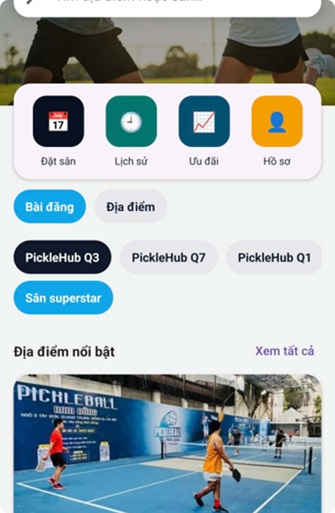
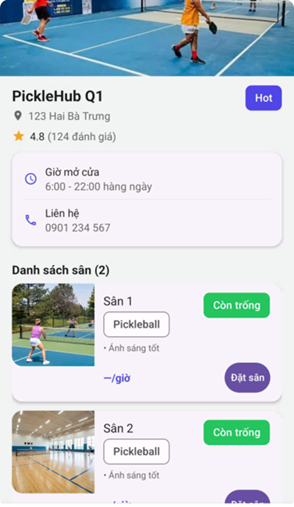
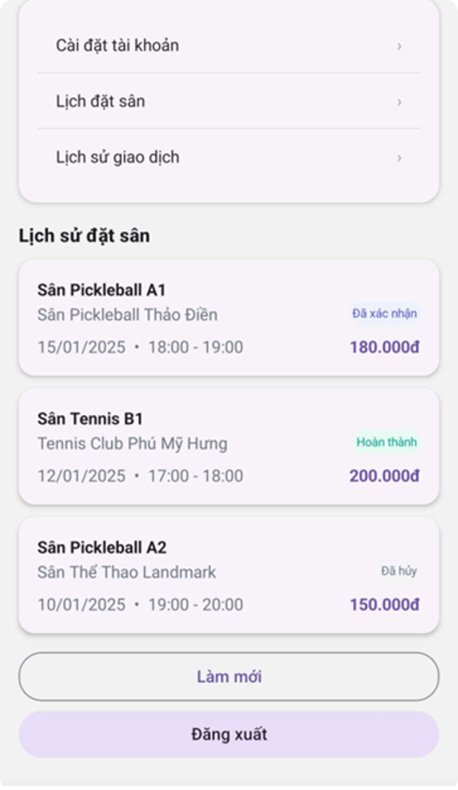
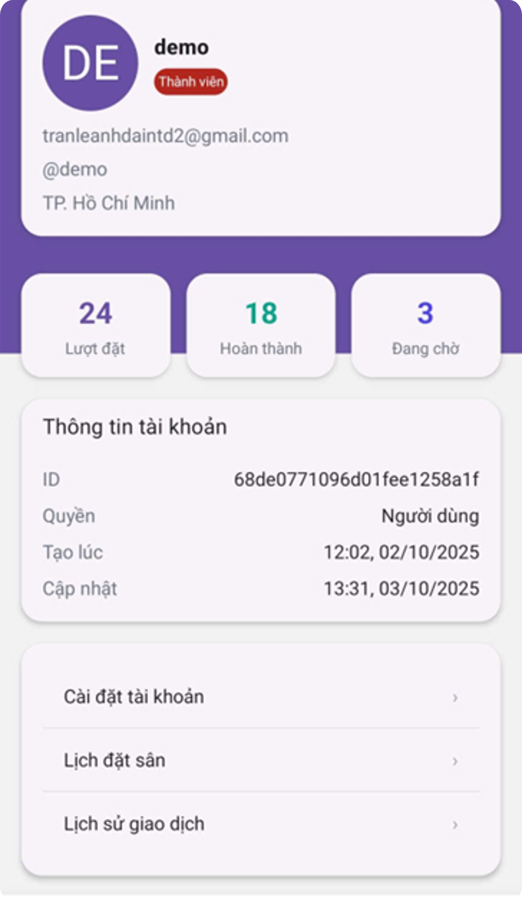

# Pickleball Court Booking System

A full-stack application for managing **pickleball court reservations, venues, and community posts**.  
Users can browse venues, view available courts, book timeslots, and interact with the community through posts and comments.

This project includes:

- **Backend API** built with Node.js, Express, and TypeScript
- **Frontend mobile/web client** built with React / React Native
- **MongoDB database** for storing application data

---

## Features

### User Features
- User registration and login (JWT authentication)
- Browse venues and courts
- Check court availability
- Book timeslots
- View and manage personal bookings
- Payment support
- Community posts, comments, and likes
- Password reset via email

### Admin Features
- Manage venues and courts
- View booking summaries
- Monitor transfers and bookings
- Upload court cover images
- Admin dashboard overview

---

## Tech Stack

### Backend
- Node.js
- Express
- TypeScript
- MongoDB
- Mongoose
- JWT Authentication
- Nodemailer (email service)
- Zod (request validation)

### Frontend
- React / React Native
- TypeScript
- Expo
- Custom hooks architecture

### Other Tools
- Cloudinary (image upload)
- Day.js (date handling)
- bcryptjs (password hashing)

---

## Project Structure

```
pickle-project
│
├── pickle-api (Backend)
│   ├── src
│   │   ├── middleware
│   │   ├── models
│   │   ├── routes
│   │   ├── scripts
│   │   ├── utils
│   │   └── index.ts
│
├── pickle-courts (Frontend)
│   ├── src
│   │   ├── api
│   │   ├── components
│   │   ├── hooks
│   │   ├── screens
│   │   ├── types
│   │   └── utils
```

---

## Backend Setup

### 1 Install dependencies

```bash
cd pickle-api
npm install
```

### 2 Configure environment variables

Create a `.env` file:

```env
MONGODB_URI=mongodb://127.0.0.1:27017/pickleball
PORT=3000

JWT_SECRET=your_secret
JWT_EXPIRES=604800
```

### 3 Run development server

```bash
npm run dev
```

Server will run at:

```
http://localhost:3000
```

---

## API Endpoints

### Authentication

```
POST /api/auth/register
POST /api/auth/login
POST /api/auth/reset-password
```

### Courts

```
GET /api/courts
GET /api/courts-by-venue
```

### Bookings

```
POST /api/bookings
GET /api/bookings
```

### Venues

```
GET /api/venues
POST /api/venues
```

### Posts

```
GET /api/posts
POST /api/posts
```

### Upload

```
POST /api/upload
```

---

## Health Check

```
GET /health
GET /api/health
```

---

## Automated Booking Expiration

The system includes a background job that automatically **expires unpaid bookings** after the hold period.

This job runs every **60 seconds**.

---

## Future Improvements

- Online payment gateway integration
- Real-time booking updates
- Push notifications
- Court availability calendar view
- Docker deployment

---

## Author

Developed as a personal project to practice **full-stack development and system design**.
## Screenshots

<p align="center">
  
  
</p>

<p align="center">
  
  
</p>
